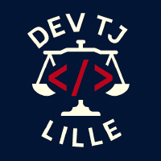

<table>
<tr>
<td></td>
<td>

# Tribunal Judiciaire de Lille — Solutions d’Automatisation RPA

</td>
</tr>
</table>

Bienvenue sur l’espace GitHub du **Tribunal Judiciaire de Lille**, dédié au développement d’applications d’automatisation (RPA - Robotic Process Automation) destinées à améliorer l’efficacité de nos procédures internes.

---

## 🚀 Projets disponibles

### 💻 ACSS

**Objectif :** Automatiser le traitement des affaires classées sans suites sur CASSIOPEE.

- 🔗 [Accéder au dépôt GitHub](https://github.com/RPA-TJ-Lille/ACSS)

---

### 🤖 BARÔBAJ

**Objectif :** Automatiser le remplissage des formulaires sur le portail SIAJ.

- 🔗 [Accéder au dépôt GitHub](https://github.com/RPA-TJ-Lille/BAROBAJ)

***__Ancienne Démarche :__***

- 🔄 [Dernière version : v1.1.0](https://github.com/RPA-TJ-Lille/BAROBAJ/releases/tag/v1.1.0)
- 📥 [Télécharger l’application](https://github.com/RPA-TJ-Lille/BAROBAJ/releases/download/v1.1.0/RPA-BAROBAJ-v1.1.0.zip)

***__Nouvelle Démarche :__***

- 🔄 [Dernière version : v1.1.1](https://github.com/RPA-TJ-Lille/BAROBAJ/releases/tag/v1.1.1)
- 📥 [Télécharger l’application](https://github.com/RPA-TJ-Lille/BAROBAJ/releases/download/v1.1.1/RPA-BAROBAJ-v1.1.1.zip)

---

### 📭 IMPRIMFIP

**Objectif :** Automatiser le dépôt de courriers sur la plateforme IMPRIM'FIP.

- 🔗 [Accéder au dépôt GitHub](https://github.com/RPA-TJ-Lille/IMPRIMFIP)
- 🔄 [Dernière version : v1.2.0](https://github.com/RPA-TJ-Lille/IMPRIMFIP/releases/tag/v1.2.0)
- 📥 [Télécharger l’application](https://github.com/RPA-TJ-Lille/IMPRIMFIP/releases/download/v1.2.0/RPA-IMPRIMFIP-v1.2.0.zip)

---

### 📧 DECISIONBAJ

**Objectif :** Automatiser le traitement et l’envoi des décisions d’aide juridictionnelle aux avocats via Outlook.

- 🔗 [Accéder au dépôt GitHub](https://github.com/RPA-TJ-Lille/DECISIONBAJ)
- 🔄 [Dernière version : v1.1.0](https://github.com/RPA-TJ-Lille/DECISIONBAJ/releases/tag/v1.1.0)
- 📥 [Télécharger l’application](https://github.com/RPA-TJ-Lille/DECISIONBAJ/releases/download/v1.1.0/RPA-DECISIONBAJ-v1.1.0.zip)

---

## 💡 Contact et support

Pour toute question ou demande d'assistance technique, veuillez contacter le référent informatique du **Tribunal Judiciaire de Lille**.

---

© Tribunal Judiciaire de Lille — Tous droits réservés

